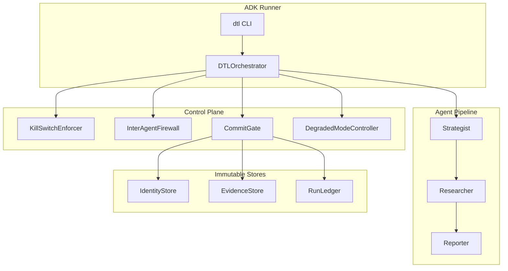
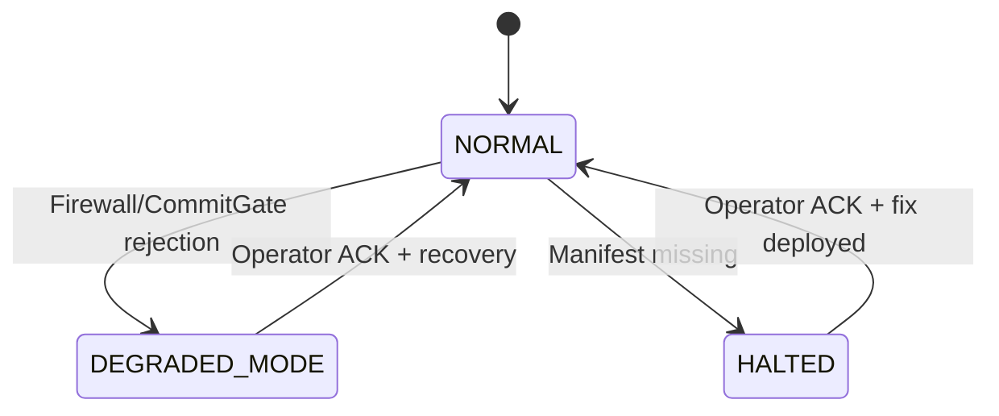

# DTL v2.0 Architecture Documentation

## Overview

DTL (Dynamic Trading Layer) v2.0 is a multi-agent system implementing deterministic, governed execution of trading analysis workflows.

## Core Principles

1. **Determinism**: All outputs are reproducible given the same inputs and `run_ts`
2. **Fail-Closed**: Missing components cause hard failures, not silent degradation
3. **Capability Governance**: Agents can only perform actions declared in their SKILL.md manifests
4. **Immutability**: Committed data cannot be modified, only appended

---

## System Architecture



---

## 8-Step Enforcement Order

| Step | Component | Action |
|------|-----------|--------|
| 1 | Orchestrator | Load policy snapshot |
| 2 | Orchestrator | Load capability manifests |
| 3 | KillSwitchEnforcer | Enforce kill switches |
| 4 | Strategist + Firewall | Run → validate envelope |
| 5 | Researcher + Firewall | Run → validate envelope |
| 6 | Reporter | Build CommitBundle |
| 7 | CommitGate | Validate (7 checks) |
| 8 | Stores | Write to immutable stores |

---

## Component Reference

### Control Plane (`src/control_plane/`)

| File | Purpose |
|------|---------|
| `commit_gate.py` | 7-check validation before writes |
| `firewall.py` | Schema + injection pattern validation |
| `kill_switch.py` | Emergency shutdown controls |
| `degraded_mode.py` | State transitions and recovery |
| `stores.py` | IdentityStore, EvidenceStore, RunLedger |

### Agents (`src/agents/`)

| Agent | Manifest | Capabilities |
|-------|----------|--------------|
| Strategist | `strategist.skill.md` | read_market_data, propose_plan |
| Researcher | `researcher.skill.md` | read_plan, collect_evidence |
| Reporter | `reporter.skill.md` | read_evidence, write_report |
| Diagnostician | `diagnostician.skill.md` | read_all, analyze |

### Configuration (`config/`)

| File | Purpose |
|------|---------|
| `adk_determinism.json` | LLM temperature, top_p settings |
| `kill_switches.json` | Active emergency switches |
| `degraded_mode_policy.json` | Trigger conditions and recovery |
| `schemas/` | JSON schemas for validation |

---

## State Machine



---

## CLI Commands

```bash
# Run DTL pipeline
dtl run --mode=mock --run_id=RUN-001

# Validate a bundle
dtl validate-bundle data/bundles/my_bundle.json

# Check system state
dtl status

# Recover from degraded mode
dtl recover --run_id=RUN-001 --operator_ack
```

---

## Testing Summary

| Suite | Tests | Coverage |
|-------|-------|----------|
| CommitGate | 23 | Branch coverage |
| Firewall | 20 | Schema + injection |
| Integration | 11 | Happy path |
| DEGRADED_MODE | 5 | State transitions |
| Adversarial | 7 | Injection attempts |
| Mutation | 4 | Hash detection |

**Total: 544 tests passing**

---

## Migration from v1.0

### Breaking Changes

1. **Output format**: `quant_outputs/` now uses DTL envelope structure
2. **Manifests required**: All agents must have `.skill.md` files
3. **Kill switches**: New config format in `kill_switches.json`
4. **Immutable stores**: `run_ledger.json` → `data/ledger/YYYY/MM/DD/`

### Migration Steps

1. Update launchd plists to use `dtl run` instead of direct Python
2. Create `.skill.md` manifests for any custom agents
3. Migrate existing ledger data to directory structure
4. Test with `--mode=mock` before going live

---

## Version: 2.0.0

Released: 2025-12-26
